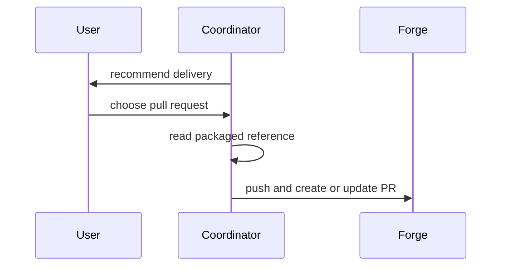

# Publish an accepted change as a pull request

The explicit pull-request choice authorizes one-time publication of the accepted change. It does not authorize merging the pull request, monitoring it, responding to later activity, or changing the agreed scope.

## Establish the publication source

Work from the exact Coordinator checkout and accepted change. Reinspect its final diff, commits, status, intended base, verification evidence, and any material limitations; do not reconstruct the result only from Worker reports. If accepted content still needs a commit, the explicit pull-request choice authorizes committing exactly that content. Stop on unrelated changes, an uncertain base or remote, or any doubt about what was accepted. Pin the resulting clean revision before writing or publishing its description.

Determine whether the accepted head already has an open pull request. Update that exact pull request instead of creating a duplicate. Never force-push. If an operation fails or returns an uncertain result after it may have changed the remote, inspect the remote state before doing anything else and do not automatically repeat it.

## Show the change to the reviewer

Open with why the change exists and its observable result, then show the smallest view that makes the important change obvious. Visuals are explanations, not decoration; omit anything that does not help the reviewer understand behavior, structure, risk, or evidence.

Choose the visual language that matches the change:

| Change shape | Prefer |
| --- | --- |
| Rule or algorithm | compact pseudocode |
| Runtime control flow | call tree or before/after flow |
| Ownership or file responsibility | shallow annotated file tree |
| Component structure | component tree with relevant state and boundaries |
| Interaction or data movement | Mermaid sequence or flow diagram |
| Modification to an existing shape | fenced `diff` with `-` and `+` |
| Rendered behavior | comparable before/after screenshots |
| Quantitative claim | small table with measured values |

For example, show a changed flow as a diff rather than describing each step in prose:

```diff
 accepted change
-  → merge or publish through ordinary tooling
+  → classify human review
+  → recommend a delivery route
+  → stop when no route was selected
+  → read publication procedure only after PR choice
```

Show ownership as a shallow tree:

```text
COORDINATOR.md               # decides and authorizes the route
references/publish-pr.md     # executes the selected PR route
extensions/coordinator.ts    # injects the contract and reference path only
```

Use Mermaid only when relationships or ordering would otherwise be harder to follow:



Place each visual beside the text it supports. Prefer one strong visual over several repetitive ones. Use plain prose when a visual would add no information.

## Layer the remaining information

After the visual explanation:

- state the Coordinator's already-decided `Human review: Required` or `Human review: Optional`, including a short reason and, when required, the specific review focus;
- present evidence that directly supports the affected promises, such as an exercised workflow, before/after screenshot, measurement, or relevant checks;
- include limitations only when they are material.

Omit empty sections and implementation chronology. Do not claim evidence that was not observed. Do not expose local paths, credentials, private logs, or unpublished local artifacts. Screenshots and other media must have a deliberate reviewer-accessible destination before they are linked.

Adapt the body to the change instead of forcing a fixed template.

## Publish once

Push the accepted branch with ordinary Git and forge tooling, then create or update the pull request with the prepared title and body. Verify that the resulting pull request targets the intended base and exact accepted head. Report the complete pull-request URL, the published revision, the human-review classification, and any evidence limitation. Stop after this one-time publication.
